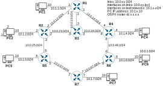
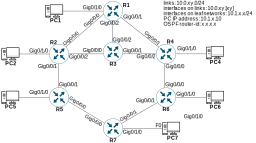

# OSPF

In this exercise, we will enable OSPF on 7 routers, to enable end-to-end pings from the end-hosts. Additionally, you will configure a number of optional OSPF features.

## Step 0: Setup

We will enable OSPF on the following network:



## Step 1: Enable OSPF across the network. 

Enable OSPF on all interfaces. All router's interfaces should belong in Area 0. At the end, all PCs should be able to ping all other PCs.

## Step 2: Disable OSPF hellos on leaf subnets

Disable the transmission of OSPF Hello messages on leaf subnets. The leaf subnets themselves should be advertised into OSPF area 0, but now the PCs should not be receiving any OSPF packets.

## Step 3: Manually configure router-IDs

Normally, routers will select one of the IP addresses of their up/up interfaces as the OSPF process' Router-ID, at the time when the OSPF process starts up.

## Solution

## Step 0: Setup

If you use Packet Tracer to run this exercise's network, you should:

1. use the ISR 4331 routers
2. Add the GLC-TE SFP into the router's Gig0/0/2 interface
3. Add the NIM-ES2-4 module into the router's NIM slot
4. Connect all PCs to each of their respective router's Gig0/1/0 port

At the end, you should get a physical topology similar to the following:



Below is the **R1** configuration to setup the IP addressing:

```
hostname R1
!
interface GigabitEthernet0/0/0
 ip address 10.0.12.1 255.255.255.0
 no shutdown
!
interface GigabitEthernet0/0/1
 ip address 10.0.14.1 255.255.255.0
 no shutdown
!
interface GigabitEthernet0/0/2
 ip address 10.0.13.1 255.255.255.0
 no shutdown
!
interface GigabitEthernet0/1/0
 switchport mode access
!
interface Vlan1
 ip address 10.1.1.1 255.255.255.0
 no shutdown
```

The configuration of all routers is quite similar to the above.

The PCs should set the local router's Vlan1 interface's IP address as the default gateway.

To verify that all the IP addresses have been correctly configured, we can ping all the directly connected IP addresses:

```
R7#ping 10.0.67.6

Type escape sequence to abort.
Sending 5, 100-byte ICMP Echos to 10.0.67.6, timeout is 2 seconds:
!!!!!
Success rate is 100 percent (5/5), round-trip min/avg/max = 0/0/0 ms

R7#ping 10.0.57.5

Type escape sequence to abort.
Sending 5, 100-byte ICMP Echos to 10.0.57.5, timeout is 2 seconds:
!!!!!
Success rate is 100 percent (5/5), round-trip min/avg/max = 0/0/0 ms

R7#
```

And from **PC6**:

```
C:\>ping 10.1.6.6

Pinging 10.1.6.6 with 32 bytes of data:

Reply from 10.1.6.6: bytes=32 time<1ms TTL=255
Reply from 10.1.6.6: bytes=32 time<1ms TTL=255
Reply from 10.1.6.6: bytes=32 time<1ms TTL=255
Reply from 10.1.6.6: bytes=32 time<1ms TTL=255

Ping statistics for 10.1.6.6:
    Packets: Sent = 4, Received = 4, Lost = 0 (0% loss),
Approximate round trip times in milli-seconds:
    Minimum = 0ms, Maximum = 0ms, Average = 0ms

C:\>
```

Naturally, the PCs cannot ping each other across the network:

```
C:\>ping 10.1.6.10

Pinging 10.1.6.10 with 32 bytes of data:

Reply from 10.1.1.1: Destination host unreachable.
Reply from 10.1.1.1: Destination host unreachable.
Reply from 10.1.1.1: Destination host unreachable.
Request timed out.

Ping statistics for 10.1.6.10:
    Packets: Sent = 4, Received = 0, Lost = 4 (100% loss),

C:\>
```

Once you have verified that all routers and PCs can ping all their directly connected neighbors, we can move on to configuring OSPF.

## Step 1: Enable OSPF across the network. 

To enable OSPF on an interface, you must configure `ip ospf 1 area 0` under each interface's configuration mode. For example, on **R4**, you should run:

```
interface GigabitEthernet0/0/0
 ip ospf 1 area 0
!
interface GigabitEthernet0/0/1
 ip ospf 1 area 0
 !
interface GigabitEthernet0/0/2
 ip ospf 1 area 0
!
interface Vlan1
 ip ospf 1 area 0
```

After you enable OSPF on all interfaces of the network, you should be able to ping across the network. For example, below we can see how **PC5** can now ping **PC4**:

```
C:\>ping 10.1.4.10

Pinging 10.1.4.10 with 32 bytes of data:

Reply from 10.1.4.10: bytes=32 time<1ms TTL=124
Reply from 10.1.4.10: bytes=32 time<1ms TTL=124
Reply from 10.1.4.10: bytes=32 time<1ms TTL=124
Reply from 10.1.4.10: bytes=32 time<1ms TTL=124

Ping statistics for 10.1.4.10:
    Packets: Sent = 4, Received = 4, Lost = 0 (0% loss),
Approximate round trip times in milli-seconds:
    Minimum = 0ms, Maximum = 0ms, Average = 0ms

C:\>
```

## Step 2: Disable OSPF hellos on leaf subnets

To verify that OSPF is enable on the Vlan 1 interface of the routers, you can run the `show ip ospf interface brief` command to see how OSPF in enabled on each interface:

```
R4#show ip ospf interface brief
Interface     PID   Area    IP Address/Mask          Cost  State  Nbrs F/C
Gig0/0/0        1   0       10.0.46.4/255.255.255.0   1      BDR  0/0
Gig0/0/1        1   0       10.0.14.4/255.255.255.0   1       DR  0/0
Gig0/0/2        1   0       10.0.34.4/255.255.255.0   1       DR  0/0
Vlan            1   0       10.1.4.4/255.255.255.0    1       DR  0/0

R4#
```

To verify that the router has formed all its expected adjacencies, use the `show ip ospf neighbor` command:

```
R4#show ip ospf neighbor 

Neighbor ID     Pri   State           Dead Time   Address         Interface
6.6.6.6           1   FULL/DR         00:00:34    10.0.46.6       GigabitEthernet0/0/0
1.1.1.1           1   FULL/BDR        00:00:34    10.0.14.1       GigabitEthernet0/0/1
3.3.3.3           1   FULL/BDR        00:00:34    10.0.34.3       GigabitEthernet0/0/2
R4#
```

To disable of transmissions on the Vlan 1 interface, we must configure the `passive-interface Vlan1` command under the OSPF process configuration mode:

```
router ospf 1
 passive-interface Vlan1
```

To verify that the OSPF process is not transmitting OSPF messages on the passive interface, use the `show ip protocols` command to confirm:

```
R4#show ip protocols 

Routing Protocol is "ospf 1"
  ...
  Passive Interface(s): 
    Vlan1
  ...
```

## Step 3: Manually configure router-IDs

To manually configure a Router-ID of the OSPF process, we must configure the `router-id` command under the OSPF process configuration mode. For example, on **R3**:

```
router ospf 1
 router-id 3.3.3.3 
```

Once you configure the router-id on an OSPF process that is already running, IOS will inform you that this change will only take effect at the next start of the OSPF process. IOS will not automatically restart the OSPF process as soon as you change the router-id. To force a restart of the OSPF process, you must issue the `clear ip ospf process` global EXEC command:

```
R3#clear ip ospf process
Reset ALL OSPF processes? [no]: yes

R3#
```

To verify the OSPF process' Router-ID, use the `show ip protocols` command:

```
R4#show ip protocols 

Routing Protocol is "ospf 1"
  ...
  Router ID 3.3.3.3
  ...
```

## Complete configurations

In the end, the configurations of all routers should look something like the following:

**R1**:

```
hostname R1
!
interface GigabitEthernet0/0/0
 ip address 10.0.12.1 255.255.255.0
 ip ospf 1 area 0
 no shutdown
!
interface GigabitEthernet0/0/1
 ip address 10.0.14.1 255.255.255.0
 ip ospf 1 area 0
 no shutdown
!
interface GigabitEthernet0/0/2
 ip address 10.0.13.1 255.255.255.0
 ip ospf 1 area 0
 no shutdown
!
interface Vlan1
 ip address 10.1.1.1 255.255.255.0
 no shutdown
!
router ospf 1
 router-id 1.1.1.1
 passive-interface Vlan1
```

**R2**:

```
hostname R2
!
interface GigabitEthernet0/0/0
 ip address 10.0.12.2 255.255.255.0
 ip ospf 1 area 0
 no shutdown
!
interface GigabitEthernet0/0/1
 ip address 10.0.25.2 255.255.255.0
 ip ospf 1 area 0
 no shutdown
!
interface GigabitEthernet0/0/2
 ip address 10.0.23.2 255.255.255.0
 ip ospf 1 area 0
 no shutdown
!
interface Vlan1
 ip address 10.1.2.2 255.255.255.0
 no shutdown
!
router ospf 1
 router-id 2.2.2.2
 passive-interface Vlan1
!
```

**R3**:

```
hostname R3
!
interface GigabitEthernet0/0/0
 ip address 10.0.23.3 255.255.255.0
 ip ospf 1 area 0
 no shutdown
!
interface GigabitEthernet0/0/1
 ip address 10.0.34.3 255.255.255.0
 ip ospf 1 area 0
 no shutdown
!
interface GigabitEthernet0/0/2
 ip address 10.0.13.3 255.255.255.0
 ip ospf 1 area 0
 no shutdown
!
router ospf 1
 router-id 3.3.3.3
```

**R4**:

```
hostname R4
!
interface GigabitEthernet0/0/0
 ip address 10.0.46.4 255.255.255.0
 ip ospf 1 area 0
 no shutdown
!
interface GigabitEthernet0/0/1
 ip address 10.0.14.4 255.255.255.0
 ip ospf 1 area 0
 no shutdown
!
interface GigabitEthernet0/0/2
 ip address 10.0.34.4 255.255.255.0
 ip ospf 1 area 0
 no shutdown
!
interface Vlan1
 ip address 10.1.4.4 255.255.255.0
 no shutdown
!
router ospf 1
 router-id 4.4.4.4
 passive-interface Vlan1
```

**R5**:

```
hostname R5
!
interface GigabitEthernet0/0/0
 ip address 10.0.57.5 255.255.255.0
 ip ospf 1 area 0
 no shutdown
!
interface GigabitEthernet0/0/1
 ip address 10.0.25.5 255.255.255.0
 ip ospf 1 area 0
 no shutdown
!
interface Vlan1
 ip address 10.1.5.5 255.255.255.0
 ip ospf 1 area 0
 no shutdown
!
router ospf 1
 router-id 5.5.5.5
 passive-interface Vlan1
```

**R6**:

```
hostname R6
!
interface GigabitEthernet0/0/0
 ip address 10.0.46.6 255.255.255.0
 ip ospf 1 area 0
 no shutdown
!
interface GigabitEthernet0/0/1
 ip address 10.0.67.6 255.255.255.0
 ip ospf 1 area 0
 no shutdown
!
interface Vlan1
 ip address 10.1.6.6 255.255.255.0
 ip ospf 1 area 0
 no shutdown
!
router ospf 1
 router-id 6.6.6.6
 passive-interface Vlan1
```

**R7**:

```
hostname R7
!
interface GigabitEthernet0/0/0
 ip address 10.0.57.7 255.255.255.0
 ip ospf 1 area 0
 no shutdown
!
interface GigabitEthernet0/0/1
 ip address 10.0.67.7 255.255.255.0
 ip ospf 1 area 0
 no shutdown
!
interface Vlan1
 ip address 10.1.7.7 255.255.255.0
 ip ospf 1 area 0
 no shutdown
!
router ospf 1
 router-id 7.7.7.7
 passive-interface Vlan1
```
